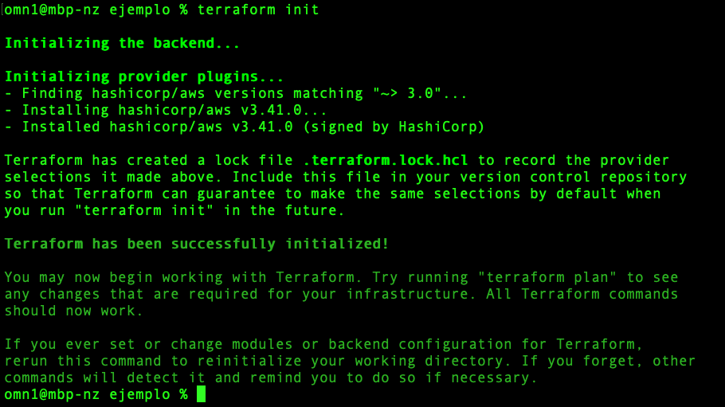
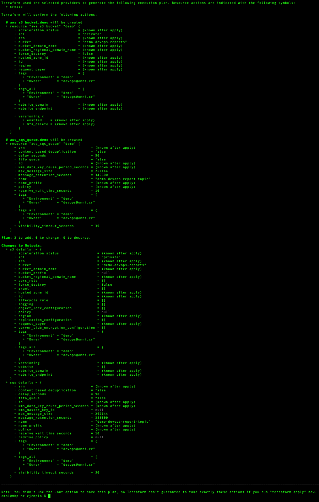
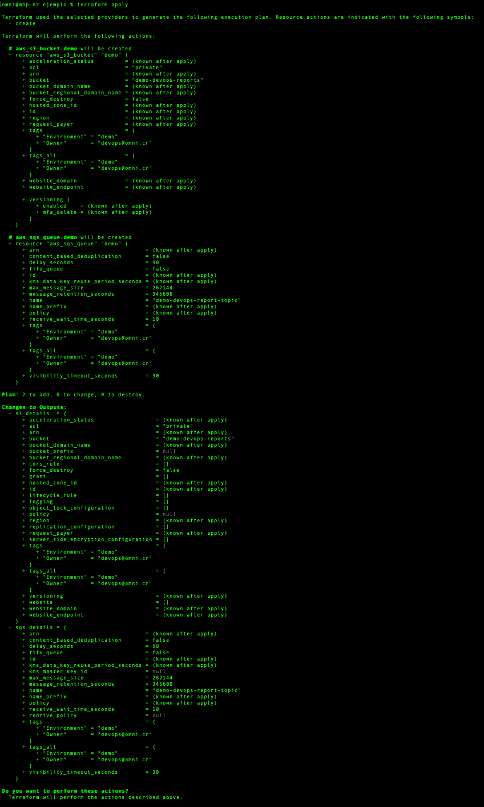
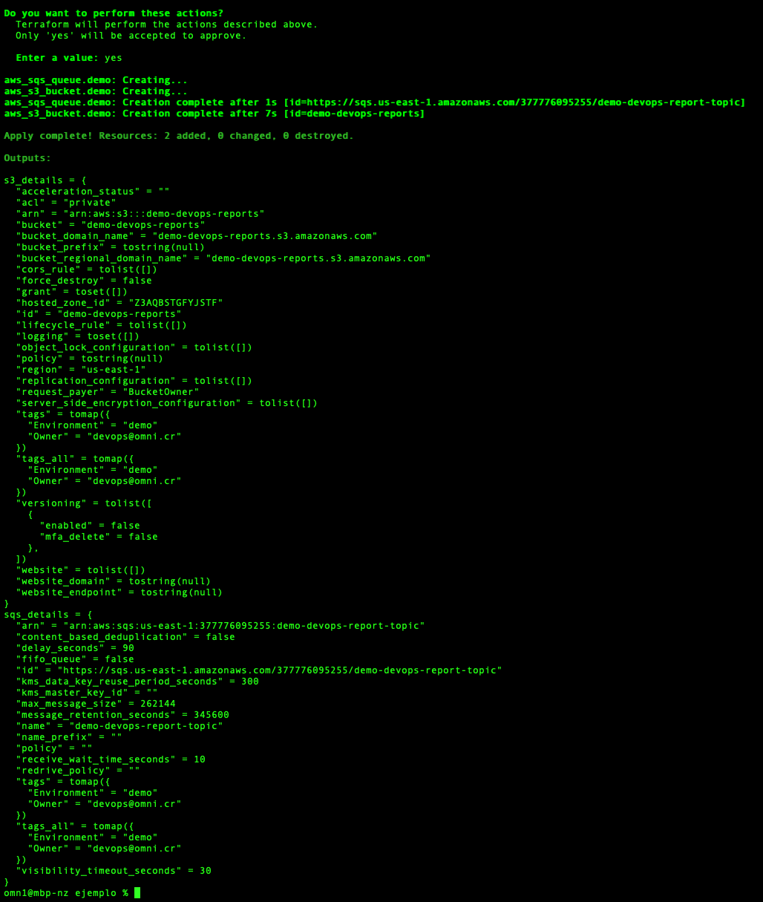
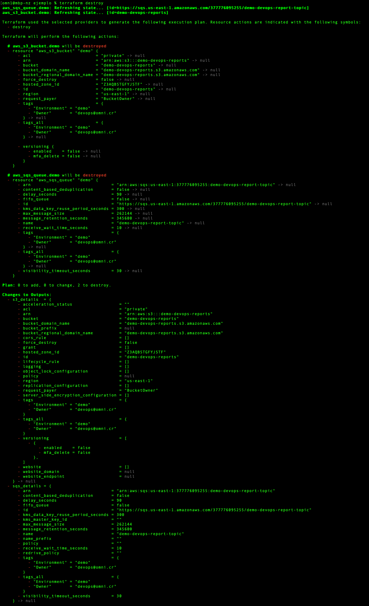
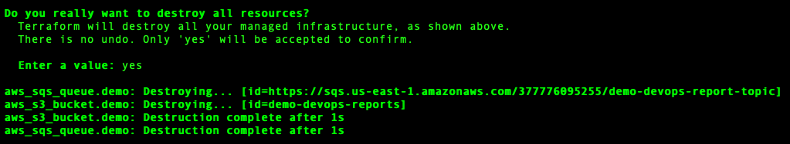


  
  

# Demo terraform

Para este demo, inicializaremos nuestra configuración de terraform, luego crearemos y destruiremos los siguientes componentes en AWS:

 1. Una cola de SQS
 2. Un bucket de S3
 

## Requisitos

 - Terraform > v0.15.1
 - Credenciales de AWS 
 

## Inicializando la configuración

Comando: `terraform init`
Salida esperada: 

## Creando componentes

Para crear crear componentes es necesario:

 1. Crear un plan. Comando: `terraform plan`. Salida esperada: 
 2. Aplicar el plan.  Comando: `terraform apply`. Salida esperada: 
 3. Confirmar la acción y esperar a que los componentes sean creados. Salida esperada: 

## Eliminando componentes
Para eliminar componentes es necesario: 
1. Ejecutar el comando:`terraform destroy`. Salida esperada: 
2. Confirmar la acción y Esperar a que los componentes sean destruidos. Salida esperada: 

Author Information
------------------

**Owner:** DevOps
**Contact:** [devops@omni.cr](mailto:devops@omni.cr?subject=[demo-terraform]%20Role%20Nginx)

